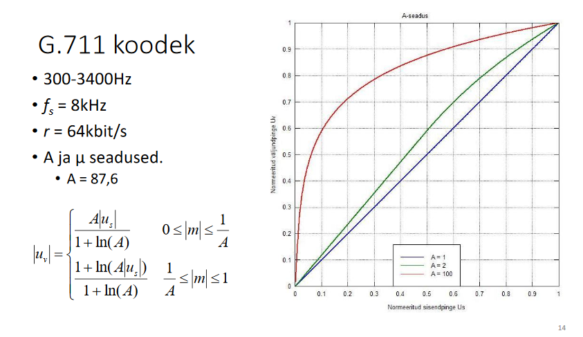

# IEEE1100 Arvutivõrgud konspekt

### 1. Informatsiooni mõiste ja mõõtühikud

__ÜL 1__

informatsioon - teadmatuse vähenemise määr
sõnumis m sisalduva informatsiooni hulk:
$$
I(m) = log_a\left(\frac{1}{p(m)}\right) = -log_a p(m)
$$

Informatsiooni mõõtühikud:

- a = 2: bitt, bait
- a = e: nat
- a = 10: hartley

### 2. Shannoni entroopia

__ÜL 13, 14__

- informatsiooniallika poolt toodetava informatsiooni hulk
  $$
  H(A) = \displaystyle\sum_{j=1}^{N} p(a_j)I(a_j) = -\displaystyle\sum_{j=1}^{N} p(a_j)\log_2{p(a_j)}
  $$
  

### 3. Shannon-Weaveri mudel, selle koostisosad ja nende funktsioonid

### 4. Signaali mõiste, ühe ja mitmemõõtmelised signaalid, signaalid ajas ja ruumis

- ajas või ruumis muutuv füüsikaline suurus
- s(t), s(x,y,z), s(x,y,z,t)
- signaal kui edastab informatsiooni mingi nähtuse käitumise või parameetrite kohta

### 5. Siinussignaal ja selle parameetrid

__ÜL 3__

$$
s(t) = A · \sin(2\pi f t + \varphi)
$$

- A – Amplituud ehk max kõrvalekalle keskmisest (signaal -A kuni A)
- f – sagedus ehk ajaühikus toimuvate täisvõngete arv [Hz]
- ω=2πf – ringsagedus, ajaühikus kaetava faasinurga suurus [rad/s] 
- T – periood ehk täisvõnke kestus. (T = 1/f)
- φ – Algfaas ehk signaali alghetk.

### 6. Signaali spekter, siinussignaal, nelinurkimpulssi ja impulssjada spektrid

TODO

### 7. Signaali võimsus, selle seos pinge ja impedantsiga

- Hetkvõimsus: p(t) = u(t)  · i(t)

- Mõõtühik on W (vatt)

- Tähiseks on P või S

- Signaali (pinge) efektiivväärtus: (Um on pinge amplituut) 
  $$
  U = \frac{U_m}{\sqrt2} = \frac{U_{pp}}{2\sqrt2} = \sqrt{P}
  $$

- Oomi seadus:
  $$
  i(t) = \frac{u(t)}{Z}
  $$

- Järelikult: 
  $$
  p(t) = \frac{u^2(t)}{Z} = i^2(t)  · Z
  $$
  

### 8. Logaritmilised mõõtühikud, detsibell(dB, dBm, dBV, ...)

Kahe võimsuse suhet mõõdetakse detsibellides:
$$
K[dB] = 10  · \log\frac{P_2}{P_1}
$$

Teisendusvalemid (Võimsusele):

$$
P[dBW] = 10  · \log\frac{P}{1W}
$$

$$
P[dBm] = 10  · \log\frac{P}{1mW}
$$

$$
P[mW] = 10^{\frac{P[dBm]}{10}}
$$

TODO 20 kordne?

### 9. Müra ja selle võimsus. Signaal-müra suhe.

$$
SNR[db] = S[dBm] - N[dBm]
$$

$$
SNR[kordades] = \frac{S[w]}{N[w]}
$$

### 10. Signaali-ja süsteemi ribalaius.

- Signaali spektri kõrgeima ja madalaima sageduse erinevus [Hz]
  $$
  B = f_{max} - f_{min}
  $$

### 11. Shannoni valem ja Shannoni piir, spektraalefektiivsuse mõiste, Hartley seadus.

#### Shannoni valem (Shannon-Hartley teoreem)

+ Sidekanali maksimaalne teoreetiline läbilaskevõime C [bit/s]

$$
C= B   · \log_2\left(1 + \frac{S}{N}\right) [bit/s]
$$

B - kanali ribalaius [Hz]
S - signaali võimsus [W]
N- müra võimsus [W]
C/B - spektraalefektiivsus [bit/s/Hz]

#### Hartley seadus

- Teoreetiline edastuskiirus R kanalis ribalaiusega B, kui kasutada edastamisel M erinevat sümbolit on:

  
  $$
  R = 2 B  · \log_2(M) [bitt/s]
  $$
  Kasutades Shannoni seadust saame:
  $$
  M = \sqrt{1 + \frac{S}{N}} 
  $$
  
  $$
  \frac{S}{N} = M^2 - 1
  $$
  

### 12. Koodi mõiste, koodi parameetrid.

__ÜL 13, 14__

- Koodi C all peetakse silmas ühest vastavust allika sümbolite a~i~ ja neid sümboleidkirjeldavate digitaalsete sümbolite (koodsõnade) c~i~ vahel.

- Koodsõna keskmine pikkus:

  
  $$
  L = \displaystyle\sum_{j=1}^{N} p(a_j)n(a_j) 
  $$
  

- Koodsõna liiasus (keskmise pikkuse ja entroopia erinevus)

  
  $$
  D = L - H
  $$
  

### 13. Analoog-digitaalmuundus. Diskreetimine ja kvantimine. Nyquisti kriteerium, aliased. Kvantimismüra võimsus, signaal-kvantimismüra suhe. Detsimeerimine.

- Analoogsignaal on pidev argumendis ja väärtuses s(t)
- analoogsignaali väärtused fikseeritakse mingil lõplikul hulgal ajahetkedel s(n   · Δt) - diskreetimine

#### Nyquist-Shannon-Kotelnikovi teoreem

- Kui signaali s(t) ribalaius on B hertsi, siis on see signaal täielikult määratud diskreetsete väljavõtetega ajavahemike 1/2B sekundi tagant.
- Vajalik diskreetimissamm Δt ≤ 1/(2B)
- Põhiriba signaali korral diskreetimissagedus f~s~ ≥ 2f~m~

#### Kvantimine

- Signaali väärtus diskreetsetel ajahetkedel s(n · Δt) mõõdetakse mingi lõpliku täpsusega ±q/2 ja salvestatakse digitaalsel kujul bittide arvuga n~B~.

- Kvantimissammu q suurus on määratud bittide arvuga n~B~ ja sisendpinge maksimaalse muutumisvahemikuga U~pp~(-U~m~...U~m~)

  
  $$
  q = \frac{U_{pp}}{2^{n_b} - 1} \approx \frac{U_{pp}}{2^{n_b}} = \frac{U_{m}}{2^{n_b - 1}}
  $$
  

- Kvantimisega kaasneb pöördumatu informatsioonikadu, mida iseloomustab kvantimismüra võimsusega 
  $$
  N = \frac{q^2}{12}
  $$
  

- Signaal-kvantimismüra suhe:
  $$
  SNR \approx 6  · n_B + 4,7 [dB]
  $$
  

### 14. G.711 koodek, A- ja μ seadused (kompressor ja ekspander).

### 15. Värvipildi (video) YUV kodeering. Värvivahesignaalide aladiskreetimine.

### 16. Vaskkaabel ja selle lainetakistus, terminaator.

### 17. Sumbumus ja läbikoste kaablites.

### 18. Fiiberoptiline kaabel, ehitus ja tööpõhimõte. Optiliste fiibrite tüübid ja nende kasutamine. Dispersioon fiiberoptilistes kaablites.

### 19.Liinikoodi mõiste, liinikoodide parameetrid.

### 20. Antenn ja selle parameetrid, antenni võimendus G ja ekvivalentne isotroopne kiirgusvõimsus EIRP.

### 21. Friisi valem, vaba ruumi kadu.

### 22. Lingi bilanss.

### 23. Fresneli tsoonid ja nende mõju, Fresneli tsooni laius.

### 24. Modulatsiooniviisid, digitaalne modulatsioon: ASK, FSK, PSK.  Moduleeritud signaali ajaline kuju ja spekter. Sagedustihendus FDM. Konstellatsioonidiagramm.

### 25. Bitivigade tõenäosus BER, bitivigade sõltuvus signaal-müra suhtest SNR. Biti energia suhe valge müra võimsuse spektraaltihedusse, seotus signaal-müra suhtega.

### 26. Skrämbleri, tüübid, kasutamise põhjused, genereeriv polünoom.

### 27. Baitide järjekord edastamisel (endianness). MSB ja LSB, bittide järjekord edastamisel.

### 28. Veakontroll, kontrollsumma ja kontrollkood CRC.  CRC arvutamine ja kontrollimine, genereeriv polünoom. 

### 29. Kaadri alguse ja lõpu märkimine. Biti ja baidi täitmine, kontrolloktett.

### 30. Peidetud- ja avaliku sõlme probleemid raadiovõrgus.

### 31. Vookontroll, Stop-and Wait protokoll.

### 32. Andmeedastus ja vookontroll RS -232 liideses, nullmodem.

### 33. Vigu parandavad koodid. Hamingi kaal ja kaugus, koodi kaugus ja kiirus.

### 34. Hammingi kood, Hamming (7,4). Genereeriv maatriks, sündroom.

### 35. Vaheldamine (Interleaving), põhjused ja teostamine –plokkvaheldi (Block Interleaver).

### 36. Signaalide võrdlemine, rist-ja autokorrelatsioon. Koodtihendus CDMA.

### 37. Sagedushüplemine, sageduse otsene hajutamine. Teostamine ja kasutamine.

### 38. Pseudojuhuslikjada ja selle genereerimine, M-jada.

### 39. Ortogonaalne sagedustihendus OFDM. Tööpõhimõte ja kasutamine.

### 40. MIMO mõiste ja kasutamine.

### 41. Sageduste taaskasutus mobiilsidevõrgus.

### 42. Ressursijaotus mobiilsidevõrkudes: FDMA, TDMA.

### 43. Mobiilsidevõrgu ehitus ja peamised sõlmed.

### 44. GSM mobiilpositsioneerimine, TA parameeter.

### 45. Pinge ja vool elektriahelas, nende otsene ja kaudne mõõtmine. Oomi seadus.