<script src="https://cdn.mathjax.org/mathjax/latest/MathJax.js?config=TeX-AMS-MML_HTMLorMML" type="text/javascript"></script>

# IEEE1100 Arvutivõrgud konspekt

### 1. Informatsiooni mõiste ja mõõtühikud

__ÜL 1__

informatsioon - teadmatuse vähenemise määr
sõnumis m sisalduva informatsiooni hulk:
$$
I(m) = log_a\left(\frac{1}{p(m)}\right) = -log_a p(m)
$$


Informatsiooni mõõtühikud:

- a = 2: bitt, bait
- a = e: nat
- a = 10: hartley

### 2. Shannoni entroopia

__ÜL 13, 14__

- informatsiooniallika poolt toodetava informatsiooni hulk
  $$
  H(A) = \displaystyle\sum_{j=1}^{N} p(a_j)I(a_j) = -\displaystyle\sum_{j=1}^{N} p(a_j)\log_2{p(a_j)}
  $$
  


### 3. Shannon-Weaveri mudel, selle koostisosad ja nende funktsioonid


### 4. Signaali mõiste, ühe ja mitmemõõtmelised signaalid, signaalid ajas ja ruumis

- ajas või ruumis muutuv füüsikaline suurus
- s(t), s(x,y,z), s(x,y,z,t)
- signaal kui edastab informatsiooni mingi nähtuse käitumise või parameetrite kohta

### 5. Siinussignaal ja selle parameetrid

__ÜL 3__


$$
s(t) = A · \sin(2\pi f t + \varphi)
$$

- A – Amplituud ehk max kõrvalekalle keskmisest (signaal -A kuni A)
- f – sagedus ehk ajaühikus toimuvate täisvõngete arv [Hz]
- ω=2πf – ringsagedus, ajaühikus kaetava faasinurga suurus [rad/s] 
- T – periood ehk täisvõnke kestus. (T = 1/f)
- φ – Algfaas ehk signaali alghetk.

### 6. Signaali spekter, siinussignaal, nelinurkimpulssi ja impulssjada spektrid

TODO

### 7. Signaali võimsus, selle seos pinge ja impedantsiga

- Hetkvõimsus: p(t) = u(t)  · i(t)

- Mõõtühik on W (vatt)

- Tähiseks on P või S

- Signaali (pinge) efektiivväärtus: (Um on pinge amplituut) 
  $$
  U = \frac{U_m}{\sqrt2} = \frac{U_{pp}}{2\sqrt2} = \sqrt{P}
  $$

- Oomi seadus:
  $$
  i(t) = \frac{u(t)}{Z}
  $$

- Järelikult: 
  $$
  p(t) = \frac{u^2(t)}{Z} = i^2(t)  · Z
  $$
  

### 8. Logaritmilised mõõtühikud, detsibell(dB, dBm, dBV, ...)

Kahe võimsuse suhet mõõdetakse detsibellides:
$$
K[dB] = 10  · \log\frac{P_2}{P_1}
$$


Teisendusvalemid (Võimsusele):


$$
P[dBW] = 10  · \log\frac{P}{1W}
$$

$$
P[dBm] = 10  · \log\frac{P}{1mW}
$$

$$
P[mW] = 10^{\frac{P[dBm]}{10}}
$$

TODO 20 kordne?

### 9. Müra ja selle võimsus. Signaal-müra suhe.

$$
SNR[db] = S[dBm] - N[dBm]
$$

$$
SNR[kordades] = \frac{S[w]}{N[w]}
$$


### 10. Signaali-ja süsteemi ribalaius.

- Signaali spektri kõrgeima ja madalaima sageduse erinevus [Hz]
  $$
  B = f_{max} - f_{min}
  $$


### 11. Shannoni valem ja Shannoni piir, spektraalefektiivsuse mõiste, Hartley seadus.

#### Shannoni valem (Shannon-Hartley teoreem)

+ Sidekanali maksimaalne teoreetiline läbilaskevõime C [bit/s]

$$
C= B   · \log_2\left(1 + \frac{S}{N}\right) [bit/s]
$$


B - kanali ribalaius [Hz]
S - signaali võimsus [W]
N- müra võimsus [W]
C/B - spektraalefektiivsus [bit/s/Hz]

#### Hartley seadus

- Teoreetiline edastuskiirus R kanalis ribalaiusega B, kui kasutada edastamisel M erinevat sümbolit on:

  
  $$
  R = 2 B  · \log_2(M) [bitt/s]
  $$
  Kasutades Shannoni seadust saame:
  $$
  M = \sqrt{1 + \frac{S}{N}} 
  $$
  
  $$
  \frac{S}{N} = M^2 - 1
  $$
  

### 12. Koodi mõiste, koodi parameetrid.

__ÜL 13, 14__

- Koodi C all peetakse silmas ühest vastavust allika sümbolite a<sub>i</sub> ja neid sümboleidkirjeldavate digitaalsete sümbolite (koodsõnade) c<sub>i</sub> vahel.

- Koodsõna keskmine pikkus:


$$
  L = \displaystyle\sum_{j=1}^{N} p(a_j)n(a_j) 
$$

- Koodsõna liiasus (keskmise pikkuse ja entroopia erinevus)

  
  $$
  D = L - H
  $$
  

### 13. Analoog-digitaalmuundus. Diskreetimine ja kvantimine. Nyquisti kriteerium, aliased. Kvantimismüra võimsus, signaal-kvantimismüra suhe. Detsimeerimine.

- Analoogsignaal on pidev argumendis ja väärtuses s(t)
- analoogsignaali väärtused fikseeritakse mingil lõplikul hulgal ajahetkedel s(n   · Δt) - diskreetimine

#### Nyquist-Shannon-Kotelnikovi teoreem

- Kui signaali s(t) ribalaius on B hertsi, siis on see signaal täielikult määratud diskreetsete väljavõtetega ajavahemike 1/2B sekundi tagant.
- Vajalik diskreetimissamm Δt ≤ 1/(2B)
- Põhiriba signaali korral diskreetimissagedus f<sub>s</sub> ≥ 2f<sub>m</sub>

#### Kvantimine

- Signaali väärtus diskreetsetel ajahetkedel s(n · Δt) mõõdetakse mingi lõpliku täpsusega ±q/2 ja salvestatakse digitaalsel kujul bittide arvuga n<sub>B</sub>.

- Kvantimissammu q suurus on määratud bittide arvuga n<sub>B</sub> ja sisendpinge maksimaalse muutumisvahemikuga U<sub>pp</sub> (-U<sub>m</sub> ...U<sub>m</sub> )


$$
  q = \frac{U_{pp}}{2^{n_b} - 1} \approx \frac{U_{pp}}{2^{n_b}} = \frac{U_{m}}{2^{n_b - 1}}
$$

- Kvantimisega kaasneb pöördumatu informatsioonikadu, mida iseloomustab kvantimismüra võimsusega 
  $$
  N = \frac{q^2}{12}
  $$

- Signaal-kvantimismüra suhe:
  $$
  SNR \approx 6  · n_B + 4,7 [dB]
  $$
  

### 14. G.711 koodek, A- ja μ seadused (kompressor ja ekspander).


### 15. Värvipildi (video) YUV kodeering. Värvivahesignaalide aladiskreetimine.

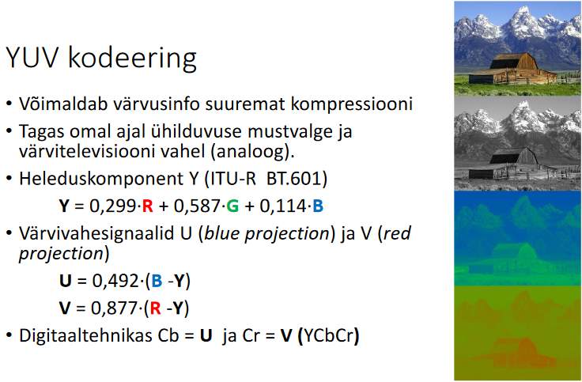

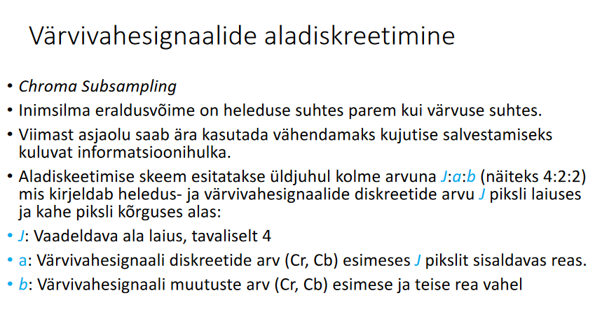

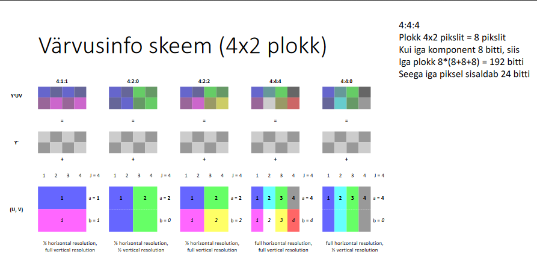

### 16. Vaskkaabel ja selle lainetakistus, terminaator.

TODO

### 17. Sumbumus ja läbikoste kaablites.

TODO

### 18. Fiiberoptiline kaabel, ehitus ja tööpõhimõte. Optiliste fiibrite tüübid ja nende kasutamine. Dispersioon fiiberoptilistes kaablites.

TODO

### 19.Liinikoodi mõiste, liinikoodide parameetrid.

__ÜL 12__

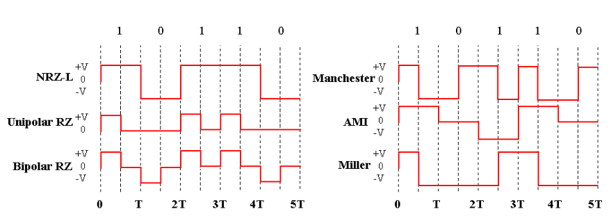

Mõõdetakse näiteks keskmist pinget.

### 20. Antenn ja selle parameetrid, antenni võimendus G ja ekvivalentne isotroopne kiirgusvõimsus EIRP.

- Antenn muundab elektrivoolu energia elektromagnetkiirguse energiaks ja vastupidi.

- Antenni parameetrid:

  - Antenni võimendus G[dBi]
    $$
    G = 10 · \log_{10}\left(\frac{P_{max}}{P_{Iso}}\right)
    $$

  - Impedants Z<sub>a</sub>

  - Töösagedused _f_<sub>min</sub> ... _f_<sub>max</sub> (ribalaius B)

  - Suunadiagramm D(θ,φ):

  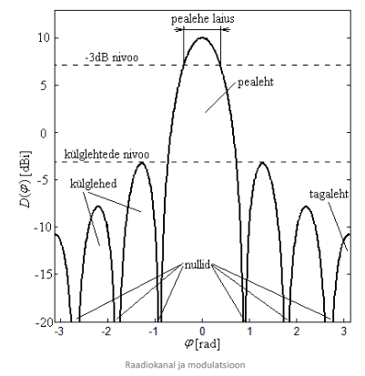


### 21. Friisi valem, vaba ruumi kadu.

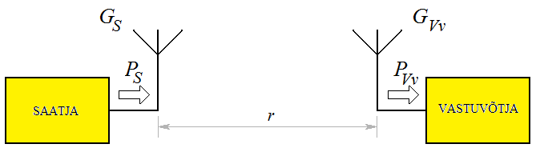

#### Vaba ruumi kadu FSL

$$
FSL = \left(\frac{4\pi d}{\lambda}\right)^2
$$

kus 

- *d [m]* on saatja ja vastuvõtja vaheline kaugus
- *λ [m]* on lainepikkus, mis avaldub valemiga *λ = c / f*, kus *c* on valguse kiirus (*3∙10<sup>8</sup>  m/s*) ja *f [Hz]* on kasutatav sagedus.

Logaritmilisetes ühikuses:
$$
FSL = 20 · \log_{10}d + 20 · \log_{10}f + a
$$
kus konstandi a väärtus sõltub kasutatavatest ühikutest

- kui *f [Hz]* ja *d [m]*, siis *a = −147,55* 
- kui *f [GHz]* ja *d [km]* siis *a = 92,45* 
- kui *f [MHz]* ja *d [km]*, siis *a = 32,45* 
- kui *f [MHz]* ja *d [m]*, siis *a = −27,55* 
- kui *f [kHz]* ja *d [m]*, siis *a = −87,55* 

#### Friisi valem (lineaarsed ühikud)

$$
P_v = \frac{P_s  · G_s  · G_v}{FSL}
$$


kus

- *Pv* on vastuvõtja sisendvõimsus ühikuteks [mW] või [W]
- *Gs* on saatja antenni võimendus [kordades]
- *Gv* on vastuvõtja antenni võimendus [kordades]
- *FSL* on vaba ruumi kadu (*free space loss*) [kordades] 

### 22. Lingi bilanss. (logaritmilised ühikud)


$$
P_v = P_s + G_s + G_v - FSL - L
$$


kus

- Vastuvõtja võimsus *Pv [dBm]*
- saatja võimsus *Ps [dBm]*
- saatja antenni võimendus *Gs [dBi]* 
- vastuvõtja antenni võimendus *Gv[dBi]*
- vaba ruumi kadu *FSL [dB]*.
- Muud kaod *L* on ühikutes *dB*. 

### 23. Fresneli tsoonid ja nende mõju, Fresneli tsooni laius.

- Esimese Fresnelli tsooni raadius r<sub>1</sub> on leitav valemiga:

  
  $$
  r_1 = \sqrt{\lambda\frac{d_1  · d_2}{d_1 + d_2}}
  $$
  


- kus d<sub>1</sub> ja d<sub>2</sub> on vastavalt kaugused esimesest ja teisest antennist.

- Vähemalt 60% Fresnelli tsoonist peaks olema takistuste vaba
- Soovitatav on vähemalt 80% tsoonist.

### 24. Modulatsiooniviisid, digitaalne modulatsioon: ASK, FSK, PSK.  Moduleeritud signaali ajaline kuju ja spekter. Sagedustihendus FDM. Konstellatsioonidiagramm.

ASK - amplituudmodulatsioon (muudetakse amplituudi)
FSK - sagedusmodulatsioon (muudetakse signaali sagedust)
PSK - faasmodulatsioon (muudetakse signaali faasi)

TODO - sagedustihedus?

#### Konstellatsioonidiagramm

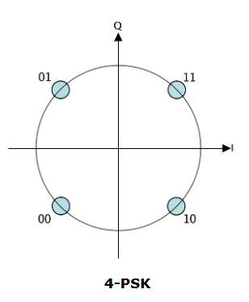

### 25. Bitivigade tõenäosus BER, bitivigade sõltuvus signaal-müra suhtest SNR. Biti energia suhe valge müra võimsuse spektraaltihedusse, seotus signaal-müra suhtega.

#### BER

Digitaalse andmeedastuse kvaliteeti iseloomustab bitivigade tõenäosus BER, mis on vigaselt vastuvõetud bittide n<sub>e</sub> arvu suhe kõikide edastatud bittide arvu n: 
$$
BER = \frac{n_e}{n}
$$


#### BER sõltuvus SNR suhtest.

Bitivigade tõenäosus sõltub signaal-müra suhtest S/N vastuvõtjas.

Digidaalsel edastusel kasutatakse S/N asemel tihtipeale biti energia E<sub>b</sub> [J] suhet valge müra võimsuse spektraaltihedusse η [W/Hz]. Viimane suurus on seotud signaal-müra suhtega spektraalefektiivsuse ρ [bitt/s/Hz] kaudu:


$$
\frac{S}{N} = \frac{E_b}{\eta} · \frac{1}{\rho}
$$


### 26. Skrämbleri, tüübid, kasutamise põhjused, genereeriv polünoom.

#### Skrämbler (scrambler)

- Füüsilise kihi seade, mille ülesandeks on bittide järjekorra (pseudo) juhuslik ümberjärjestamise
- Põhjused
  - Vältimaks pikki ainult ühest sümbolist koosnevaid jadasi
  - Lihtsustamaks vastuvõtjas kella sünkroniseerimist
  - Tagab ülekantava signaali spektri kuju sõltumatuse edastatavast informatsioonist

##### Aditiivne skrämbler (sünkroonne skrämbler)

Edastatavale signaalile liidetakse (mooduliga kaks) pseudojuhuslik binaarne jada

Tekitatakse tihti tagasisidestatud nikeregistriga. Pseudojuhuslik jada on täielikult määratud nihkeregistri algseisu ja genereeriva polünoomiga (tagasiside võtmise kohtadega): 1 + x<sup>-14</sup> + x<sup>-15</sup>

Tagamaks algsete andmete korrektset taastamist peab deskrämbler töötama sünkroonselt, selleks lisatakse edastatavatele andmettele sünkrosõnad

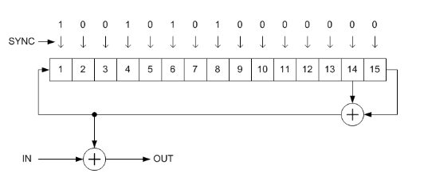

##### Multiplikatiivne skrämbler

- Nimetatakse isesünkroniseeruvaks skrämbleriks

- Korrutab sisendsignaali iseenda ülekandefunktsiooniga

- Ei vaja sünkroniseerimist.

- On määratud samuti polünoomiga. Algseis pole kriitiline, kuid vajab sünkroniseerivaid andmeid enne päris andmeid.

- Kui deskrämbleri sisendkoodis on ühekordne viga, siis väljundis on vigade arv korrutatud tagasisideühenduste arvuga.

  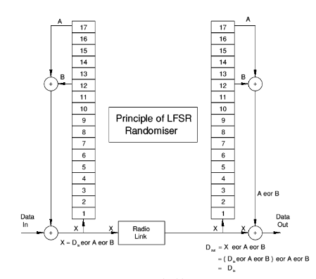

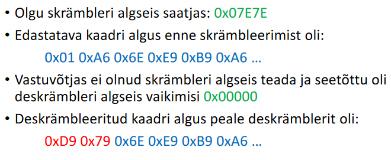


### 27. Baitide järjekord edastamisel (endianness). MSB ja LSB, bittide järjekord edastamisel.

big-endian (edastatakse esmalt kõige suureb bit), little-endian (edastatakse esmalt kõige väiksem bit).

MSB - most significant bit

LSB - least significant bit

### 28. Veakontroll, kontrollsumma ja kontrollkood CRC.  CRC arvutamine ja kontrollimine, genereeriv polünoom. 

##### Paarsuskontroll

- Paketile lisatakse paarsusbitt, nii et väärtusega 1 bittide arv paketis koos paarsussbitiga oleks kas paaris või paaritu. Paarsuskontroll suudab tuvastada vaid paaritu arv vigu.

  - paaris paarsuskontroll  - paaris arv ühtesi

    ```
    A tahab saata:           1001
    A arvutab paarsusbiti:   1^0^0^1 = 0   
    A lisab paarsusbiti:     10010
    B võtab vastu:           10010
    B arvutab paarsuse:      1^0^0^1^0 = 0
    B teatab õnnestunud ülekandest, kuna paarsuskontroll osutus õigeks.
    ```

  - paaritu paarsuskontroll - paaritu arv ühtesi

    ```
    A tahab saata:           1001
    A arvutab paarsusbiti:   ~(1^0^0^1) = 1   
    A lisab paarsusbiti:     10011
    B võtab vastu:           10011
    B arvutab paarsuse:      1^0^0^1^1 = 1
    B teatab õnnestunud ülekandest, kuna paarsuskontroll osutus õigeks.
    ```

#### CRC (kontrollkood)


CRC kontrollkoodi genereeriv polünoomi esimene sümbol on __alati 1__ (isegi kui ei ole mainitud)

Näites on kasutusel

+ genereeriv polünoom 10011 ehk 0x3 ehk x<sup>1</sup> + x<sup>0</sup>. 
+ edastatavad andmebitid 1100101.
+ Saadetav signaal on 1100101 0010

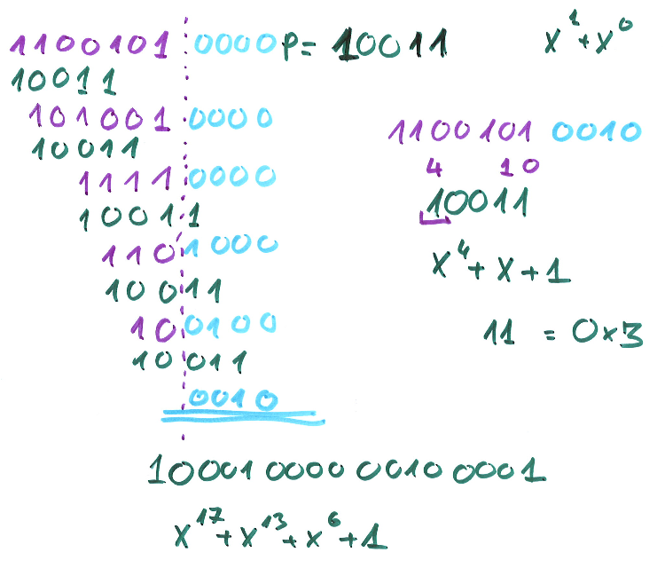

### 29. Kaadri alguse ja lõpu märkimine. Biti ja baidi täitmine, kontrolloktett.

- Kaadri algust ja lõppu tähistatakse spetsiifilise väljaga (flag): 0x7E
- Kui kaadri sees oleks sama bitijärjestus loetaks see kaadri lõpuks
- Lahenduseks on _bit stuffing_ - iga viie järjestikuse "1" järele listakse "0" (farssbitt)
- Kui edastatakse andmeid baidi kaupa on mõislikum kasutada _byte stuffing´u nimelist tehnikat
  - HDLC protokollis kasutatakse spetsiaalset sümbolit 0x7D (_control escape octet_), mis asetatakse iga kaadri sees oleva 0x7E või 0x7D okteti ette. Lisaks inverteeritakse vastava okteti viies bitt.

### 30. Peidetud- ja avaliku sõlme probleemid raadiovõrgus.

TODO

### 31. Vookontroll, Stop-and Wait protokoll.

#### Stop-and-wait

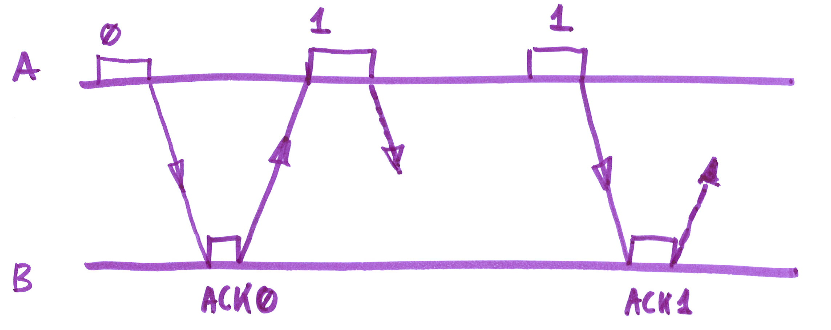

### 32. Andmeedastus ja vookontroll RS -232 liideses, nullmodem.

Nullmodemi puhul on vookontroll ühendatud enda külge (sisuliselt ei kontrollita, kas saab edastada)

### 33. Vigu parandavad koodid. Hamingi kaal ja kaugus, koodi kaugus ja kiirus.

###### Hammingi kaal

Koodsõna c Hammingi kaaluks w{c} nimetatakse tema  mittenulliste koordinaatide arvu.

###### Hammingi kaugus

Kahe koodsõna ci ja cj vaheliseks kauguseks nimetatakse nende koordinaatide arvu, milles nad üksteisest erinevad. h= d{ci,cj}=w{ci ⊕cj}

###### Minimaalne kaugus

Koodi __C__ minimaalseks kauguseks h<sub>min</sub> nimetakse kahe erineva koodsõna vähimat kaugust
$$
h_{min} = d\{c_i, c_j \}\space \space \space i \neq j
$$


##### Hammingi kood

- Lineaarne binaarne plokk-kood minimaalse kaugusega h<sub>min</sub> = 3.
- Iga täisarvu r ≥ 2 korral on ploki pikkus n= 2<sup>r</sup> -1, millest informatsiooni kannab k= 2<sup>r</sup>-r-1 bitti ja ülejäänud on paarsusbitid.
- Suudab parandada ühekordseid bitivigu

###### Koodi kiirus

Informatsiooni edastavate bittide arvu k suhet kogu ploki pikusesse n:
$$
R = \frac{k}{n}
$$


Hammingu koodi kiirus:
$$
R = 1 - \frac{r}{2^r - 1}
$$


### 34. Hammingi kood, Hamming (7,4). Genereeriv maatriks, sündroom.

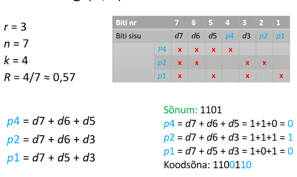

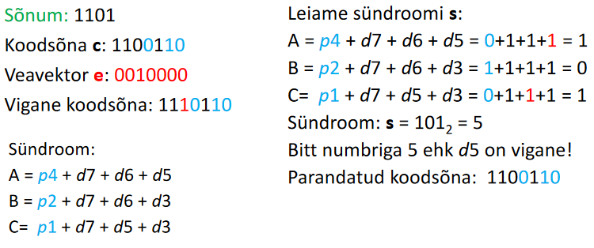

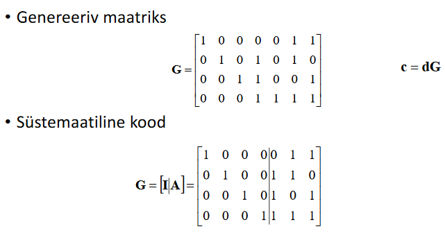

#### Paarsuskontrolli maatriks

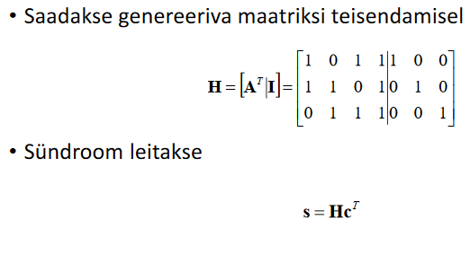

#### Hamming(7,4) lubatud koodsõnad

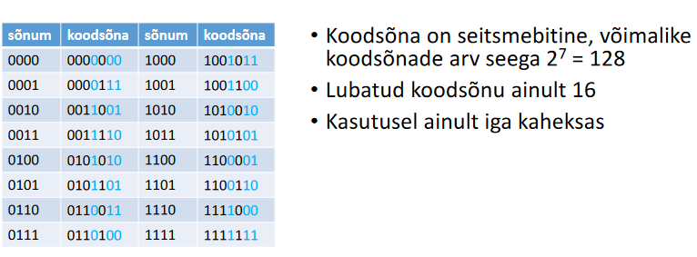

### 35. Vaheldamine (Interleaving), põhjused ja teostamine –plokkvaheldi (Block Interleaver).

- Vigu parandavad koodid suudavad parandada suhteliselt suurt hulka vigu, kui need vead on andmetes ühtlaselt jaotunud.
- Praktikas kipuvad vead esinema gruppidena (_error burst_)
- Vaheldi (_Interleaver_) on seade, mis vähendab veapursete mõju ja parandab vigu parandavate koodide tõhusust. 
- Vaheldi muudab enne andmete saatmist andmete järjekorda selliselt, et järjestiku eksisteerivad andmed ei paikne edastamisel lähestikku.

#### Plokkvahendi (_block interleaver_)

- Olgu edastatavaks sõnumiks järgnev tekst:

  - SeeOnVaheldamiseNäide

- Peale veapurset on andmetest kadunud neli järjestikust sümbolit:

  - SeeO____eldamiseNäide

- __Vaheldamist__ kasutades, edastatavad andmed pannakse ridahaaval n×m maatriksisse.

  ​	 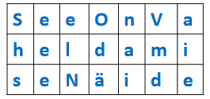

- Andmed edastatakse sideliinis veergude kaupa.

  - ShseeeelNOdänaiVmdaie 

- Nii ei paikne kõrvutised sümbolid edastamisel koos. Samas tekib edastamisel viide, mis on tingitud tabeli kirjutamisest enne edastamise algust ja lugemisest peale vastuvõtu lõppu.

- Kui nüüd kustub edastatud jadas veapurske tõttu neli järjestikust sümbolit on tulemus järgmine:

  - ShseNOdänaiVmdaie

- Kohalejõudev maatriks:

   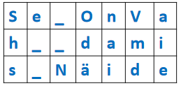

- Peale sümbolite õige järjekorra taastamist on veapurse jaotunud ühtlasemalt sõnumi peale laiali:

  - Se_OnVah__daamis_Näide

### 36. Signaalide võrdlemine, rist-ja autokorrelatsioon. Koodtihendus CDMA.


### 37. Sagedushüplemine, sageduse otsene hajutamine. Teostamine ja kasutamine.


### 38. Pseudojuhuslikjada ja selle genereerimine, M-jada.


### 39. Ortogonaalne sagedustihendus OFDM. Tööpõhimõte ja kasutamine.


### 40. MIMO mõiste ja kasutamine.


### 41. Sageduste taaskasutus mobiilsidevõrgus.


### 42. Ressursijaotus mobiilsidevõrkudes: FDMA, TDMA.


### 43. Mobiilsidevõrgu ehitus ja peamised sõlmed.


### 44. GSM mobiilpositsioneerimine, TA parameeter.


### 45. Pinge ja vool elektriahelas, nende otsene ja kaudne mõõtmine. Oomi seadus.